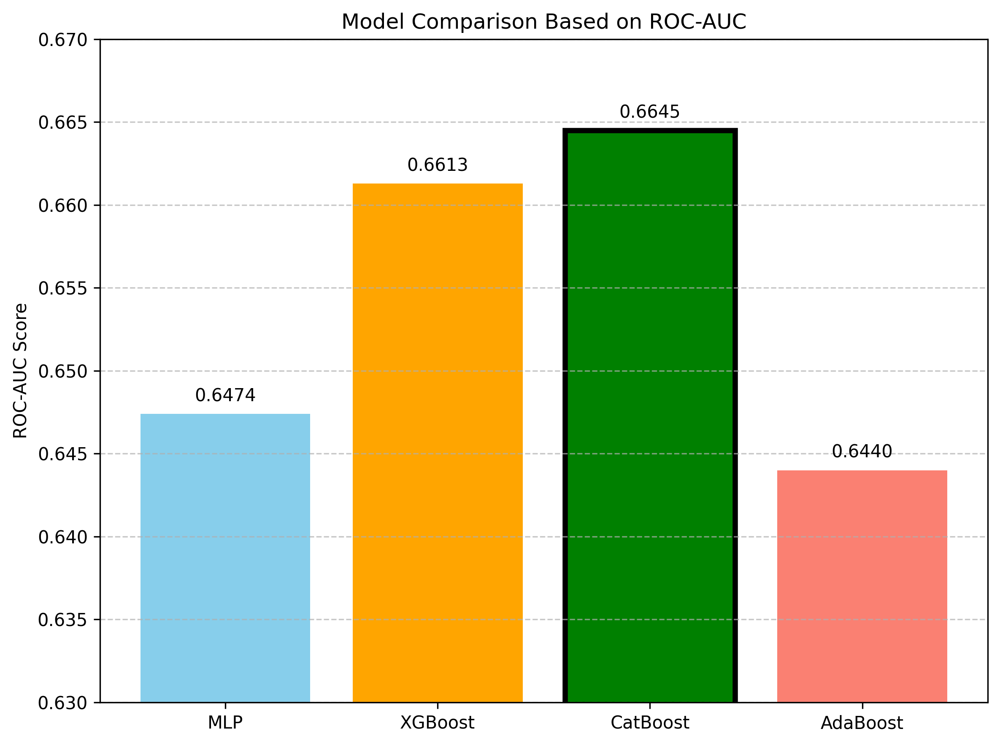

# TML25_A1_3

## 📌 Team 3 – Assignment 1 for the Trustworthy Machine Learning (TML) Course 2025

This repository contains our solution to **Assignment 1** of the **TML25** course. In this assignment, we developed and evaluated a machine learning model to perform adversarial attacks and analyze their impact.

---

## 📁 Repository Structure

| File / Folder                              | Description                                                                 |
|-------------------------------------------|-----------------------------------------------------------------------------|
| [`TML_Assignment_1.ipynb`](TML_Assignment_1.ipynb) | Main Jupyter notebook containing data loading, preprocessing, model training, and evaluation. |
| [`best_attack_model_catboost.pkl`](best_attack_model_catboost.pkl) | Saved CatBoost model used for adversarial attack generation or prediction. |
| [`test.csv`](test.csv)                     | Provided test data used for generating predictions or testing the model.   |
| [`TML_report.pdf`](TML_report.pdf)                     | Report file.   |

---

## 🧠 Summary Approach 

- We experimented with several models, including XGBOOST, CatBoost, AdaBoost, and MLP, and found that **CatBoost** performed the best in terms of robustness and predictive accuracy.

The plot below compares the ROC-AUC scores of different models we experimented with:



## 🚀 How to Run

1. Clone this repository:
   ```bash
   git clone https://github.com/YourUsername/TML25_A1_3.git
   cd TML25_A1_3

2. Load the model:
    ```bash
   import joblib
   model = joblib.load("best_attack_model_catboost.pkl")

